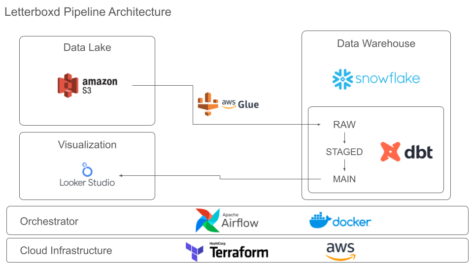
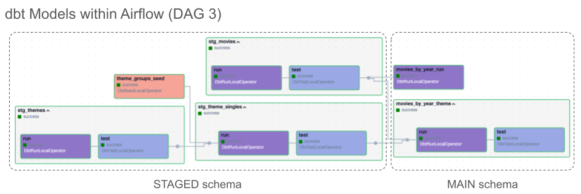

# Letterboxd Pipeline

**Objective**: This project presents data engineering principles by developing a pipeline for movie data. The pipeline extracts, processes, and loads data sourced from Letterboxd. A cloud data warehouse is implemented in Snowflake with analytics data processing handled by dbt. 

Project Start: 2024.03.01

## Architecture

- Technologies Used
  - Apache Airflow
  - AWS: Glue, S3
  - Snowflake
  - dbt
  - Terraform
  - Docker
  - Google Looker Studio

## Data Source
- [Letterboxd Dataset (Kaggle)](https://www.kaggle.com/datasets/gsimonx37/letterboxd): Movie data is extracted from [Letterboxd](https://letterboxd.com/) and [The Movie Database (TMDB)](https://www.themoviedb.org/). Letterboxd is a global social network for film discussion and discovery.
  - The dataset is hosted on Kaggle as a collection of 9 CSV files and over 700,000 movie posters. When compressed, the files make up 23.29 GB. 
  - The 9 CSV files represent movie details of over 896,000 movies released since 1874. The file `movies.csv` is the base source with each record representing one movie. The other 8 CSV files augment the base source with additional information: actors, countries, crew, genres, languages, releases, studios, and themes. 
  - The project makes use of the 9 CSV files while ignoring the poster images.  

## Pipeline Outline
- Terraform is used to programmatically create the following resources:
  - An S3 bucket serving as a data lake 
  - An AWS Glue crawler, Glue catalog database, and Glue job
  - A Snowflake database with three schemas that serve as a traditional data warehouse
  - A Snowflake compute resource (i.e. virtual data warehouse)
  - A service user in Snowflake with appropriate privileges
  - A secret in AWS Secrets Manager to manage Snowflake credentials
- Orchestration of the pipeline is handled by Apache Airflow running in a custom Docker container on a local machine. A sequence of three DAGS complete the following steps: 
  - Extract 9 compressed CSV files from the zip file downloaded from Kaggle. 
  - Convert each CSV file into a parquet file with appropriate schema. Transfer the corresponding parquet files to the S3 bucket. 
  - Run the Glue crawler to create a Glue metadata catalog of the parquet files. Run the Glue job to transfer the parquet files to the Snowflake data warehouse's RAW schema. 
  - Execute a dbt build to process the raw data into STAGED and MAIN schemas. The following high-level processing steps are followed:
    - Seed a dimension table that maps 109 themes into 18 theme groups.
    - Remove movies with missing release year. Deduplicate movies and themes.
    - Generate an aggregated data mart table that summarizes movie count and length by two parameters: release year and theme. 
- The dbt project is parsed and converted into Airflow DAGs via the [Astronomer Cosmos](https://www.astronomer.io/cosmos/) package. 



## Data Visualization
- A simple dashboard that consumes the aggregated table in Snowflake can be found here: [Looker Studio Dashboard](https://lookerstudio.google.com/s/ongh3z7W-uA)
<iframe width="800" height="450" src="https://lookerstudio.google.com/embed/reporting/dfa1db6c-c11e-448d-bd53-5321227b5e57/page/n9LsD" frameborder="0" style="border:0" allowfullscreen sandbox="allow-storage-access-by-user-activation allow-scripts allow-same-origin allow-popups allow-popups-to-escape-sandbox"></iframe>

## Setup Instructions
- Local Setup
  - Download or clone the repository to a local computer. 
  - For local testing or experimentation, create a virtual environment for python:
    ```bash
    python -m venv venv
    source venv/bin/activate
    pip install -r requirements.txt
    ```
  - Data Source
    - Download the zip file from [Kaggle](https://www.kaggle.com/datasets/gsimonx37/letterboxd).
    - Place the zip file `archive.zip` in the folder `./data/raw_data_archive/`.
- Snowflake
  - Create a [Snowflake account](https://signup.snowflake.com/) or identify an existing account with AWS as the cloud provider.
  - On the local computer, create a configuration file `~/.snowflake/config` that contains Snowflake credentials for a user with the `ACCOUNTADMIN` role:
    ```toml
    [default]
    account='<snowflake-account-identifier>'
    user='<user-name>'
    password='<user-password>'
    role='ACCOUNTADMIN'
    ```
  - These credentials will be used by Terraform when creating Snowflake resources.
- AWS - Part 1
  - Create an [AWS account](https://aws.amazon.com/) or identify an existing account.
  - Ensure that credentials for an AWS user with full admin privileges is configured on the local computer to use the AWS CLI. This user should be associated with the `default` profile and have access keys defined in the file `~/.aws/credentials`: 
    ```toml
    [default]
    aws_access_key_id = <access-key-id>
    aws_secret_access_key = <secret-access-key>
    ```
    - These credentials will be used by Terraform when creating AWS resources and by Airflow when executing DAGs. 
  - Create an IAM role `AWSGlueServiceRole`. This role will be assumed by the Glue service and can be created from the Glue console. 
- Terraform
  - Provide values for three variables: `snowflake_service_user_password`, `glue_service_role_arn`, `bucket_name`
    - This can be done by updating default values in the file `./terraform/variables.tf` or by creating environment variables in the shell at runtime. 
    - For customization, additional variables can be overridden in the modules `./terraform/modules/aws/` and `./terraform/modules/snowflake`.
  - In the directory `./terraform/`, execute `terraform apply` to create AWS and Snowflake resources. 
- AWS - Part 2
  - Create an instance of the [Snowflake Connector for AWS Glue](https://aws.amazon.com/marketplace/pp/prodview-xdyn5il56d7a2)
    - In the AWS console, provide the Snowflake account URL for the connector: `https://<account-identifier>.snowflakecomputing.com`
    - For the credentials, use the secret `letterboxd_snowflake_service_user` in AWS Secrets Manager that was generated by Terraform. 
- dbt
  - On the local computer, create a configuration file `~/.dbt/profiles.yml` that contains  credentials for the Snowflake service user. The profile should be called  `snowflake_letterboxd`:
    ```yaml
    snowflake_letterboxd:
      outputs:
        dev:
          account: <snowflake-account-identifier>
          client_session_keep_alive: false
          connect_retries: 0
          connect_timeout: 10
          database: LETTERBOXD
          password: '<snowflake-service-user-password>'
          query_tag: dbt_tag
          retry_all: false
          retry_on_database_errors: false
          reuse_connections: false
          role: SVC_LETTERBOXD_ROLE
          schema: STAGED
          threads: 4
          type: snowflake
          user: SVC_LETTERBOXD
          warehouse: LETTERBOXD_WH
      target: dev
    ```
  - This profile will be used by dbt for analytics processing within the Snowflake data warehouse. 
- Airflow on Docker
  - The following instructions assume Docker is already installed on the local machine. 
  - In the directory `./airflow/` create a file `.env` with the following values: 
    ```text
    AIRFLOW_UID=50000
    AIRFLOW_HOME=/opt/airflow/
    AIRFLOW_CONN_AWS_DEFAULT='{
      "conn_type": "aws",
      "extra": {
            "profile_name": "default",
            "region_name": "<aws-region>"
        }
    }'
    AWS_BUCKET=<s3-bucket-name>
    AWS_PROFILE=default
    ```
    - Docker will automatically pick up this `.env` file when building Airflow resources. 
  - Build docker image and run containers by executing following two commands in a terminal when in the directory `./airflow/`:
    ```bash
    docker compose build .
    docker compose up
    ```

## How to Run
- After completing setup described above, go to the Airflow UI at `localhost:8080`. 
- Execute the three DAGS in order:
  - **01_ingest_data**: Extracts raw CSV files, converts to parquet, and pushes to S3 bucket under prefix "raw". 
  - **02_run_glue_job**: Uploads Glue script to S3, runs Glue crawler on the 9 parquet files in S3, runs Glue job to transfer parquet files to Snowflake's RAW schema. 
  - **03_run_dbt**: Performs data quality tests and materializes Snowflake objects for analytical consumption. Cleansed data is presented as views in STAGED schema; aggregated data is presented as tables in MAIN schema.
